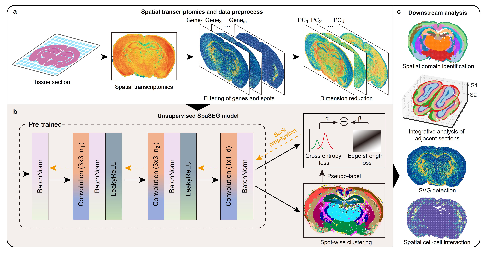
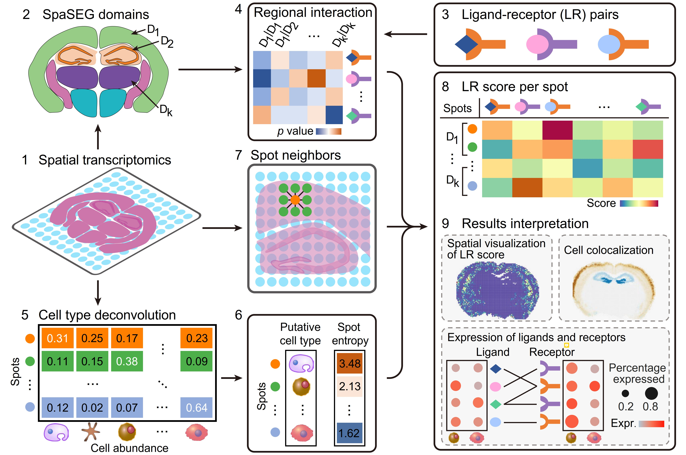
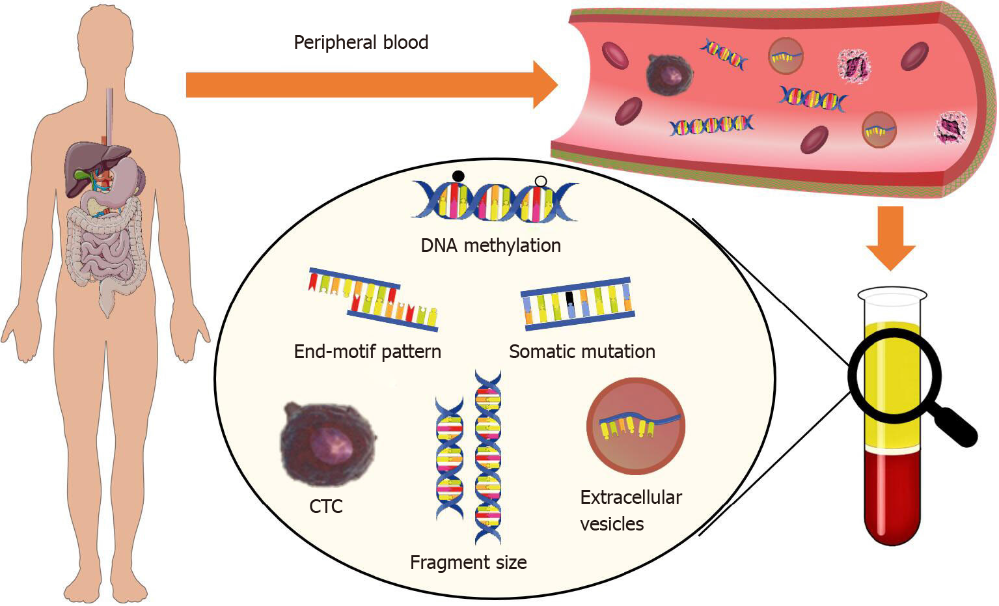

My name is Xiangyu Guo, a first-year Ph.D. student in BioEngineering (Bioinformatics and Machine Learning Track) at [King Abdullah University of Science and Technology](https://www.kaust.edu.sa/en), supervised by [Prof. Ricardo Henao](https://scholar.google.com/citations?user=p_mm4-YAAAAJ&hl=en). My current research mainly focuses at the intersection of biomedicine and artificial intelligence, including but not limited to AI in disease diagnosis and monitoring, Spatial transcriptomics algorithms development, and digital pathology. For additional details regarding my academic and professional experiences, please refer to my [CV](../files/CV-KAUST-2023.pdf).

## Recent Papers
1. Efficient reliability analysis of spatially resolved transcriptomics at varying resolutions using SpaSEG [[PDF]](https://www.biorxiv.org/content/10.1101/2022.11.16.516728v2.full.pdf) Yong Bai, **Xiangyu Guo**, Keyin Liu, et. al   **BioRxiv**, 2023.05
**SpaSEG**, an unsupervised convolutional neural network-based method towards multiple SRT analysis tasks by jointly learning transcriptional similarity between spots and their spatial dependence within tissue. SpaSEG adopts edge strength constraint to enable coherent spatial domains, and allows integrative SRT analysis by automatically aligning spatial domains across multiple adjacent sections. Moreover, SpaSEG can effectively detect spatial domain-specific gene expression patterns(SVG), and infer intercellular interactions and co-localizations.

### Overview of SpaSEG

### Overview of cell-cell interaction analysis in SpaSEG

<!-- 

 -->

2. STGIC: a graph and image convolution-based method for spatial transcriptomic clustering [[PDF]](https://arxiv.org/pdf/2303.10657.pdf) Chen Zhang, Junhui Gao, Lingxin Kong, Guangshuo cao, **Xiangyu Guo**, Wei Liu    **arXiv**, 2023.10

3. Recent advances in blood-based and artificial intelligence-enhanced approaches for gastrointestinal cancer diagnosis [[PDF]](https://www.ncbi.nlm.nih.gov/pmc/articles/PMC8473600/pdf/WJG-27-5666.pdf) Li-Shi Li, **Xiang-Yu Guo**, Kun Sun   **World Journal of Gastroenterology**, 2021.09

## Industrial Experience

- Algorithm Engineer at BGI Research, Shenzhen
- Data Scienctist in PingAn Insurance Group